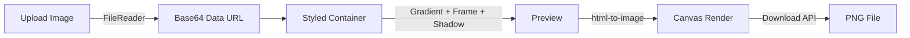

# SnapMock

**Turn screenshots into beautiful mockups instantly. Free, private, no sign-up.**


<!-- Add screenshot or demo GIF here -->
> Replace this with a GIF showing: drag screenshot in, pick gradient, add browser frame, download mockup

---

Upload a screenshot. Pick a gradient. Add a device frame. Download a polished PNG. **Everything runs in your browser — your images never leave your device.**

[**Try it live**](https://snapmock-orpin.vercel.app)

---

## Features

| | Feature | Description |
|---|---------|-------------|
| :art: | **12 Gradient Backgrounds** | Lavender, Ocean, Sunset, Peach, Mint, Berry, Night, Coral, Sky, Gold, White, Dark |
| :computer: | **Device Frames** | Browser window (macOS-style), phone (with notch), or no frame |
| :cloud: | **3 Upload Methods** | Drag & drop, click to browse, or paste from clipboard (Ctrl+V) |
| :sparkles: | **Customization** | Adjustable padding, border radius, 4 shadow levels |
| :lock: | **100% Private** | Client-side processing — zero server uploads |
| :zap: | **Instant** | No accounts, no loading spinners, no waterfall of modals |

### Free vs Pro

| | Free | Pro ($9 one-time) |
|---|------|-----------|
| Mockups | Unlimited | Unlimited |
| Backgrounds & Frames | All | All |
| Export Resolution | 2x PNG | 4x PNG |
| Custom Colors | No | Yes |
| Watermark | Yes | No |

---

## Quick Start

```bash
git clone https://github.com/beepboop2025/snapmock.git
cd snapmock
npm install
npm run dev
```

Opens at `http://localhost:3000`. That's it.

---

## How It Works



1. Image loaded into memory as base64 (never leaves the browser)
2. Rendered in a styled container with your chosen gradient, frame, and effects
3. `html-to-image` renders the DOM element to a PNG canvas at 2x/4x resolution
4. Browser download API saves the file

**No server. No upload. No tracking.** Just `FileReader` → `canvas` → `download`.

---

## Tech Stack

| Component | Technology |
|-----------|-----------|
| Framework | Next.js 16 (App Router) |
| UI | React 19, Tailwind CSS 4 |
| Export | html-to-image (client-side canvas) |
| Analytics | Vercel Analytics + Speed Insights |
| Deploy | Vercel (zero-config) |

---

## Configuration

Edit `src/app/config.ts` to connect your payment methods:

```typescript
export const CONFIG = {
  UPI_ID: "yourname@okaxis",
  PAYPAL_USERNAME: "snapmock",
  BMAC_USERNAME: "snapmock",
  CRYPTO_WALLETS: [
    { network: "Ethereum", address: "0x..." },
    { network: "Bitcoin", address: "bc1q..." },
  ],
  EMAIL_ENDPOINT: "https://formspree.io/f/...",
  PRO_PRICE: "$9",
};
```

**Payments supported:** UPI (Google Pay/PhonePe/Paytm), PayPal, Buy Me a Coffee, Crypto (ETH, BTC, SOL, BNB, Base, Polygon).

---

## Deploy

```bash
npm run build
npx vercel --prod
```

Or connect your GitHub repo to Vercel for auto-deploy on push. No environment variables required.

---

## Roadmap

- [ ] Mockup templates (tweet card, app store listing, social media post)
- [ ] Batch processing (upload multiple screenshots)
- [ ] Custom background image upload
- [ ] SVG export option
- [ ] Browser extension for one-click capture + mockup

---

## Contributing

The entire app lives in ~6 files under `src/app/`. `MockupEditor.tsx` is the core — backgrounds, frames, and export logic are all there.

---

## License

MIT
