<!-- textura-banner -->
<div align="center">
  <a href="https://github.com/beepboop2025/snapmock"></a>
</div>

# SnapMock


**Screenshot mockup generator. Upload, frame, export -- all in the browser.**


---

SnapMock turns raw screenshots into polished device mockups in seconds. Drag in an image, pick a background gradient, wrap it in a device frame, and download a high-resolution PNG. Everything runs client-side -- your images never leave your machine.

[Live Demo](https://snapmock-orpin.vercel.app)

---

## Features

- **Drag-and-drop upload** -- Drop an image, click to browse, or paste from clipboard with Ctrl+V.
- **12 gradient backgrounds** -- Lavender, Ocean, Sunset, Peach, Mint, Berry, Night, Coral, Sky, Gold, White, and Dark.
- **Device frames** -- macOS-style browser window, phone with notch, or no frame.
- **Adjustable styling** -- Padding, border radius, and four shadow levels (None, Subtle, Medium, Heavy).
- **High-resolution export** -- Download mockups as 2x or 4x PNG.
- **Custom color picker** -- Choose any background color (Pro).
- **Glassmorphism UI** -- Modern frosted-glass design with smooth animations.
- **License key system** -- One-time Pro upgrade with localStorage persistence and cross-tab sync.
- **Fully private** -- Zero server uploads. All processing happens in the browser via `html-to-image`.

---

## Tech Stack

| Layer | Technology |
|-------|------------|
| Framework | Next.js 16 (App Router) |
| UI | React 19, Tailwind CSS 4 |
| Export | html-to-image (client-side canvas rendering) |
| Language | TypeScript 5 |
| Analytics | Vercel Analytics, Vercel Speed Insights |
| Deployment | Vercel |

---

## Getting Started

### Prerequisites

- Node.js 18 or later
- npm, yarn, or pnpm

### Installation

```bash
git clone https://github.com/beepboop2025/snapmock.git
cd snapmock
npm install
```

### Development Server

```bash
npm run dev
```

The app starts at `http://localhost:3000`.

### Production Build

```bash
npm run build
npm start
```

---

## Project Structure

```
src/app/
  page.tsx                  # Landing page
  layout.tsx                # Root layout and metadata
  config.ts                 # Payment and site configuration
  globals.css               # Global styles
  hooks/
    useLicense.ts           # Pro license state management
  components/
    MockupEditor.tsx        # Core editor (backgrounds, frames, export)
    PaymentModal.tsx         # Pro upgrade payment flow
    PricingSection.tsx       # Free vs Pro comparison
    FloatingSupport.tsx      # Support widget
    EmailCapture.tsx         # Email collection form
```

---

## Configuration

Payment methods and site details are configured in `src/app/config.ts`:

```typescript
export const CONFIG = {
  UPI_ID: "",
  PAYPAL_USERNAME: "",
  BMAC_USERNAME: "",
  CRYPTO_WALLETS: [],
  EMAIL_ENDPOINT: "",
  SITE_URL: "https://snapmock-orpin.vercel.app",
  PRODUCT_NAME: "SnapMock",
  PRO_PRICE: "$9",
};
```

Supported payment methods: UPI, PayPal, Buy Me a Coffee, and crypto (ETH, BTC, SOL, BNB, Base, Polygon).

---

## Testing

The pure-logic core (payment-link builders, license-key validation, and
perceived-luminance color math) is unit-tested with [Vitest](https://vitest.dev) —
no DOM, network, or API keys required, so the suite runs green deterministically in CI.

```bash
npm test          # run the suite once
npm run coverage  # run with a coverage report
```

Coverage of the tested `src/app/lib` modules is 100% (statements, branches, functions, lines).
CI runs the suite on every push and pull request via `.github/workflows/tests.yml`.

---

## Deployment

Connect the repository to Vercel for automatic deploys on push, or deploy manually:

```bash
npx vercel --prod
```

No environment variables are required.

---

## License

This project is licensed under the [MIT License](LICENSE).
